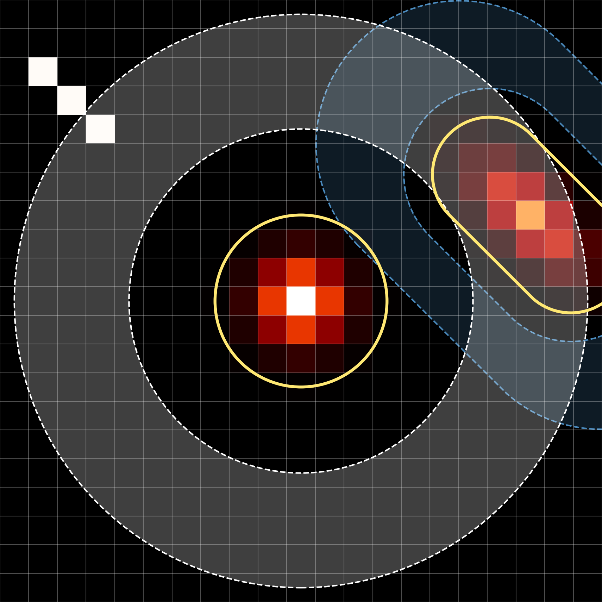

::: {.brand-header}
{fig-alt="astroapers aperture logo" .brand-mark}
{fig-alt="astroapers wordmark" .brand-wordmark width=100px}
:::

`astroapers` (`aap` in short) is a Rust-backed Python package for exact aperture overlap,
bbox-tight masks, and aperture summation in pixel coordinates.


## Key Concepts
* **Aperture** (class `PixelAp`):
  * `ap = aap.CircAp((x, y), r)`
  * An aperture is defined by a single closed-curve geometry.
* **Annulus** (class `PixelAp`):
  * `an = aap.CircAn((x, y), r_in, r_out)`
  * An annulus is a special kind of aperture, defined by two closed-curve geometries: an inner one and an outer one.
* **Aperture mask** (class `ApMask`):
  * `apm = ap.get_apmask()`.
  * One can initialize it with `apm = aap.ApMask(weights, bbox)`, but that is not the intended way - one has to prepare the weights and bounding box manually to do this.
* **Bounding Box** (class `BoundingBox`):
  * `ap.bbox` or `apm.bbox`.
  * General users will not need to access this at all.
  * The smallest rectangle that contains the aperture.
  * Defined using four `int`s: `(ixmin, ixmax, iymin, iymax)`.
  * It is a small helper to reduce calculation time and memory usage in `aap` by working only with the pixels relevant to the aperture, instead of the full image.
* **Weights** (class `ndarray`)
  * `weights` is fractional pixel overlaps, stored in `apm.weights`.
  * In real usage, users generally won't need weights directly because the aperture methods (especially `apsum`) will use them internally.
  * It is `bbox`-tight, so to get the full image-shaped mask, use a method `apm.to_image(shape)`.
* **Aperture sum** (class `float` or 1-d array):
  * `apsum = ap.apsum(data)`.
  * It internally uses `sum(data[bbox] * apm.weights)` to calculate the sum, which is memory- and computation-efficient.
* **Area** (class `float`):
  * `area = ap.area`.
  * Area is the analytic geometric area of the aperture, e.g., $\pi r^2$ for a circle.
* **Effective area** (class `float` or 1-d array):
  * `npix = apm.npix(shape, mask=...)`.
  * It is the sum of weights after excluding pixels outside the image and/or masked pixels. Therefore, `npix` $\le$ `ap.area`.
  * Since `apm` already contains `bbox` information, the image `shape` is the only required argument to correctly calculate `npix` (e.g., to exclude pixels outside the image). Optionally, a `mask` can also be passed to exclude masked pixels. Users may discard objects by `badphot = npix < area` (e.g., objects near the image edge or affected by bad pixel mask, bpm).
* **Source sum**:
  * Called `srcsum` in the tutorials.
  * It is the background-subtracted source flux, calculated as `apsum - background * npix`.
  * Since background estimation may require complicated or custom algorithms, it is not a built-in method in `aap`. Instead, users are expected to perform the calculation in Python. For example, one can define a function such as `bkg = background(an.get_apmask(method="center").weighted_values(data), **kwargs)` and then compute `ap.apsum(data) - bkg * apm.npix(data.shape)`.


## First-Look at `aap`

The object layer is usually the clearest way to express a measurement. Direct
kernel calls are useful when source coordinates already live in arrays and the
workflow is fixed.

```{python}
import numpy as np
import astroapers as aap
import astroapers.kernels as aapk

data = np.ones((16, 16), dtype=float)
xpos = np.array([8.0])
ypos = np.array([8.0])

# Quicklook - not very slow compared to direct kernel
ap = aap.CircAp((xpos[0], ypos[0]), r=3.0)
obj_apsum, obj_npix = ap.apsum(data)

# lowest-overhead direct kernel call
apsum = aapk.apsum_circ_exact(
    data,
    xpos,
    ypos,
    r=3.0,
    return_npix=False,
)

assert apsum.shape == xpos.shape
assert np.allclose(apsum[0], obj_apsum)
apsum
```

Coordinates follow the SEP/Photutils pixel convention: pixel `(x, y)` is
centered at integer coordinates and covers `[x - 0.5, x + 0.5]`.


This site has two kinds of documentation:

- [Aperture gallery](gallery.qmd), a visual catalog of built-in apertures,
  annuli, and custom `PathAp` line/circular-arc geometries.
- [API reference](api/index.qmd), generated from the package docstrings.
- Tutorials, written as runnable Quarto documents.


## Tutorial order

1. [Quickstart aperture sums](tutorials/01-quickstart.qmd): create a synthetic
   image and measure circular aperture flux.
2. [Bbox-tight masks](tutorials/02-masks.qmd): inspect `ApMask.weights`,
   `ApMask.bbox`, and `ApMask.to_image()`.
3. [Annulus background](tutorials/03-background.qmd): estimate a local
   background from an annulus and subtract it from source flux.
4. [Multiple apertures and radial profiles](tutorials/04-multiple-apertures.qmd):
   measure several apertures, check edge coverage, and sample multiple radii.
5. [Custom masks and composition](tutorials/05-custom-masks.qmd): combine
   bbox-tight weights and use externally supplied masks.
6. [ELLIPSE-style galaxy annuli](tutorials/06-ellipse-annuli-galaxies.qmd):
   measure galaxy profiles with annuli whose inner and outer ellipses can
   have different axes and angles.
7. [Wedge aperture sums for comet jets](tutorials/07-wedge-comet-jet.qmd):
   measure an asymmetric comet jet with annular wedge apertures and direct
   kernels.
8. [PathAp custom line and arc apertures](tutorials/08-pathap-custom-shapes.qmd):
   define custom closed apertures from straight lines, circular arcs, and
   explicit holes.
9. [Performance guide](tutorials/09-performance-guide.qmd): use
   `astroapers.kernels as aapk` for lowest-overhead catalog aperture sums.

## Dtype caveats

Geometry calculations and public aperture-sum results are `float64`. Direct
unmasked kernels have specialized paths for `float64`, `float32`, `int32`, and
`int16` images; **other image dtypes are converted to `float64` first**. Coordinate
inputs and scalar geometry parameters are also converted to `float64`.

Custom `ApMask` weights preserve only `float32` and `float64`. Other numeric or
boolean weight dtypes, including extended precision dtypes such as
`float128`/`longdouble` where available, are **converted to `float64`**.
Array-producing helpers such as `to_image()`, `weighted_cutout()`, and
`weighted_values()` preserve `float32` when both data and weights are `float32`,
but `ApMask.apsum()` and `ApMask.npix()` always accumulate in `float64`.

Bad-pixel arrays passed as `mask=` are converted to boolean, with `True` meaning excluded.
